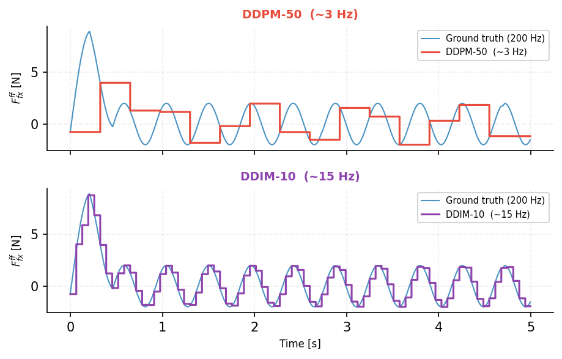

# force-insertion-policy

Generative policy training for tight-clearance peg-in-hole insertion. Trains diffusion and CVAE policies on demonstration data collected with [force-insertion-sim](https://github.com/AlexanderWegenerRobotics/force-insertion-sim) and deploys them back into the simulation environment via ONNX export.

---

## Results

### Inference Frequency

DDPM-50 runs at ~3 Hz, producing a staircase output that fails to track the expert's Lissajous wiggle pattern. DDIM-10 raises the effective policy rate to ~15 Hz and tracks the ground truth faithfully.



### Closed-Loop Performance

Evaluated over 50 episodes with randomized hole pose perturbations. DDIM-10 outperforms the deterministic expert by 17 percentage points and transfers zero-shot to unseen peg geometries without retraining.


| Model | Training Geometry | Cylinder | Rectangle | Hex |
|-------|:-----------------:|:--------:|:---------:|:---:|
| Deterministic Expert (baseline) | 61% | — | — | — |
| DDPM-50 | 67% | — | — | — |
| DDIM-5 | 62% | — | — | — |
| DDIM-10 ★ | **78%** | **74%** | **70%** | **65%** |

Zero-shot columns use DDIM-10 trained exclusively on the cylindrical peg geometry.

---

## Overview

Two generative model families are trained on the same demonstration dataset and share an identical observation/action interface:

- **Diffusion policy (DDPM + DDIM)** — iterative denoising over a learned noise estimator. An architecture search over six variants identified early fusion of all input streams as the key design choice, with DDIM sampling reducing inference latency from ~325 ms (DDPM-50) to ~59 ms (DDIM-10) without retraining.
- **CVAE** — single-pass latent decoding for faster inference at the cost of expressive capacity.

At inference, both models output a 6D feed-forward force command that is passed through a frequency alignment filter and applied via impedance control at 200 Hz in [force-insertion-sim](https://github.com/AlexanderWegenerRobotics/force-insertion-sim).

---

## Repository Structure

```
force-insertion-policy/
├── configs/
│   ├── data_config.example.yaml   ← copy this, never commit data_config.yaml
│   ├── data_config.yaml           ← your local data path (gitignored)
│   └── normalization_stats.yaml   ← tracked, recompute if dataset changes
├── diffusion/
│   ├── ddpm.py                    ← DDPM + DDIM noise estimator
│   ├── architectures.py           ← architecture variants (flat, branched, early fusion)
│   └── train.py                   ← training loop
├── cvae/                          ← CVAE model
├── shared/
│   └── normalization.py           ← normalize / denormalize utilities
├── scripts/
│   ├── compute_normalization.py   ← run once per dataset version
│   └── export_onnx.py             ← export trained model for deployment
├── notebooks/
│   └── open_loop_val.ipynb        ← open-loop validation + ablation metrics
├── docs/
│   └── plots/                     ← result figures
└── checkpoints/                   ← saved model weights (gitignored)
```

---

## Installation

```bash
git clone https://github.com/AlexanderWegenerRobotics/force-insertion-policy.git
cd force-insertion-policy
pip install -e .
```

---

## Data Setup

Data is not tracked in git. Place the dataset collected from [force-insertion-sim](https://github.com/AlexanderWegenerRobotics/force-insertion-sim) somewhere on your machine:

```
/your/local/path/force-insertion-data/
    ├── dataset_index.yaml
    ├── episode_0000/episode.h5
    ├── episode_0001/episode.h5
    └── ...
```

Configure your local path:

```bash
cp configs/data_config.example.yaml configs/data_config.yaml
# then edit data_dir in configs/data_config.yaml
```

Compute normalization statistics once per dataset version:

```bash
python scripts/compute_normalization.py
```

---

## Training

```bash
python diffusion/train.py
```

Key hyperparameters:

| Parameter | Value |
|-----------|-------|
| Architecture | Early fusion, 3 residual blocks |
| Hidden dim | 512 |
| Parameters | 1.60M |
| Batch size | 4096 |
| Learning rate | 1e-3 |
| Diffusion steps (train) | 50 |
| Diffusion steps (deploy) | 10 (DDIM) |

---

## Observation & Action Space

Both models consume the same interface:

| | Signals | Dim |
|--|---------|-----|
| **Observation** | `f_ext` (3) + `f_internal` (6) + `ee_velocity` (6) | 18 |
| **Action** | `Fff` — 6D feed-forward wrench [N, Nm] | 6 |

All channels are normalized to zero mean / unit variance using `configs/normalization_stats.yaml`.

---

## Deployment

Export a trained checkpoint to ONNX for deployment in [force-insertion-sim](https://github.com/AlexanderWegenerRobotics/force-insertion-sim):

```bash
python scripts/export_onnx.py --checkpoint checkpoints/best.pt --steps 10 --output checkpoints/ddim10.onnx
```

The `--steps` argument sets the number of DDIM denoising steps at inference time. Use `--steps 50` for standard DDPM sampling.

---

## Reference

Diffusion policy based on:
> Wu et al., *TacDiffusion: Force-domain Diffusion Policy for Precise Tactile Manipulation*, arXiv:2409.11047, 2025.

DDIM sampling:
> Song et al., *Denoising Diffusion Implicit Models*, ICLR 2021.